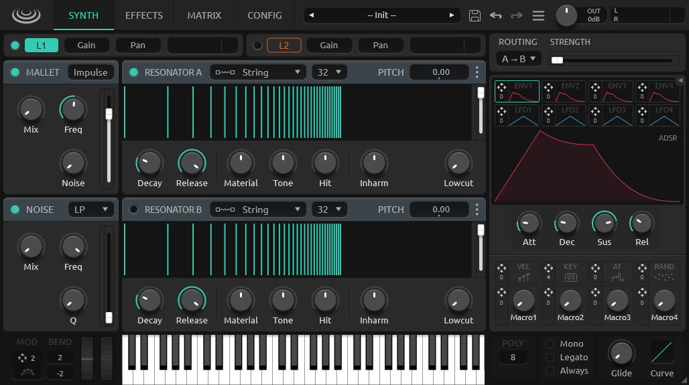

<h1 align="center">
  Rippler
  <br>
</h1>
<div align="center">

[](https://github.com/tiagolr/rippler/releases)
[](https://github.com/tiagolr/rippler/releases)
[](https://github.com/tiagolr/rippler/releases)

</div>
<div align="center">

[](https://github.com/tiagolr/rippler/releases/latest)


</div>

**Rippler** is the last iteration of the Rippler synth series, a physically modeled synthesizer with features like bi-directional resonator coupling, 12 models of acoustic resonators, and an easy to use drag-and-drop modulation system.

<div align="center">



</div>

## Features

  * **Dual Layer** architecture
  * **12 models** of acoustic resonators
  * **Parallel and Serial** resonator routing
  * **Bi-directional energy transfer** between resonators
  * **Inharmonicity, Tone, Ratio, and Material** sliders to shape the timbre
  * **Drag-and-drop**, easy-to-use modulation system
  * 4 assignable **envelopes and LFOs**
  * 4 **Macro knobs** to control multiple parameters
  * **After-touch and MPE** enabled
  * A **Factory Library** with 100+ presets
  * **Micro-tuning** and MTS supported
  * **Manual mode** with user defined tuning and snapshot morphing
  * Modular **effects chain** with 9 different effects

## Download

* [Download latest release](https://github.com/tiagolr/rippler/releases)
* Current builds include VST3 for Windows, VST3 and LV2 for Linux and AU and VST3 for macOS.

## Manual

Read the manual in the [Github Wiki Pages](https://github.com/tiagolr/rippler/wiki)

## About

**Rippler** is the fourth iteration of this synthesizer and hopefully final version, it was designed to be a *commercial synth* but later distributed a Freeware for a number of reasons.

It is pretty much what I envisioned Rippler to be from the beginning in terms of sound and functionality, with proper bi-directional resonator coupling, preset manager, factory library, and maybe with more features than I hoped for like audio rate modulations, editable modulation curves and so on - thanks to beta testers suggestions.

### Why Freeware

Although this synth was meant to be a commercial product, I can't be bothered with licensing, code signing, branding, marketing, legal, taxes and on-line activations. At best I estimate the profit would be maybe a year of salary, don't think it's worth the effort.

### Why not open source

There is little to gain from open sourcing the code, the main reason I prefer to keep it closed source is out of respect for *Applied Acoustics Systems* and their flagship Chromaphone, it took me a lot of time to figure out bi-directional coupling of resonators and would never even try if it was not for their reference synth.


## Tips

- `Shift+Drag` for fine adjustments.
- `Ctrl+Drag` to adjust modulations or create new ones.
- `DoubleClick` to reset a parameter.
- `Ctrl+DoubleClick` to clear a parameter modulation.
- `Shift+Drag` also toggles snapping on LFO and Matrix curve editor windows.
- `MouseWheel` can be used to change to change the grid on LFO and Matrix curve editor.
- Rippler supports **Audio In**, an audio side-chain can be routed to the resonators.
- There is an open-source precursor called [RipplerX](https://github.com/tiagolr/ripplerx) featuring the same resonator models.

## MacOS

Because the builds are unsigned you may have to run the following commands:

```bash
sudo xattr -dr com.apple.quarantine /path/to/your/plugins/Rippler.component
sudo xattr -dr com.apple.quarantine /path/to/your/plugins/Rippler.vst3
sudo xattr -dr com.apple.quarantine /path/to/your/plugins/Rippler.lv2
```

The commands above will recursively remove the quarantine flag from the plug-ins.